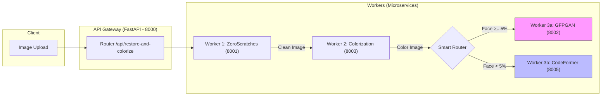

# Photo Restoration API

Một hệ thống microservices API xử lý mạnh mẽ phục vụ cho mục đích phục chế ảnh cũ, làm nét, tô màu, và khôi phục chi tiết ảnh bị hỏng.
Hệ thống sử dụng các state-of-the-art AI Models (ZeroScratches, Colorization, GFPGAN, CodeFormer, RealESRGAN) để đem lại kết quả chân thực nhất.

## 🌟 Tính Năng Chính
- **ZeroScratches:** Nhận diện và loại bỏ tự động các vết xước, vệt gập và bụi trên ảnh.
- **Colorization:** Nhuộm màu cho ảnh trắng đen cổ điển dựa trên ResNet-18 và Self-Attention.
- **Smart Face Restoration (Hybrid Upscale):** Thông minh tự động chọn mô hình dựa trên ảnh:
    - `GFPGAN`: Chuyên phục hồi siêu sắc nét cho **ảnh chân dung** (áp dụng khi diện tích mặt >= 5%).
    - `CodeFormer`: Nền tảng ổn định chuyên phục hồi khuôn mặt nhỏ cho **ảnh gia đình, tập thể** (áp dụng khi < 5%).
    - *Đặc biệt:* Cả 2 mô hình đã được tích hợp **Native Background Upscaling (x2)** bằng RealESRGAN.

## 🏗️ Kiến trúc Hệ thống



## 🚀 Cài Đặt (Local Development)

### Yêu Cầu
- Windows 10/11
- Miniconda / Anaconda
- NVIDIA GPU (Khuyến nghị VRAM >= 4GB)

### 1. Tạo môi trường Conda
Do đặc thù các thư viện AI có tệp nhị phân xung đột, dự án sử dụng nhiều môi trường:
```bash
# Môi trường 1 (ZeroScratches & Colorization)
conda create -n rs-clean python=3.10
conda activate rs-clean
pip install -r requirements-rs.txt # (nếu có riêng, hoặc setup theo guide của model)

# Môi trường 2 (GFPGAN, CodeFormer, RealESRGAN)
conda create -n gfpgan-clean python=3.10
conda activate gfpgan-clean
pip install torch torchvision torchaudio --index-url https://download.pytorch.org/whl/cu118
pip install gfpgan realesrgan basicsr facexlib
```

### 2. Cấu Hình Environment Variables
Copy file `.env.example` thành `.env` bên trong thư mục `api/` và cấu hình:
```env
CLOUDINARY_CLOUD_NAME=your_cloud_name
CLOUDINARY_API_KEY=your_key
CLOUDINARY_API_SECRET=your_secret
API_HOST=0.0.0.0
API_PORT=8000
```

### 3. Tải Pre-trained Models
Các Model Weights (.pth, .pt) phải được lưu trữ sẵn vào mục `experiments/pretrained_models/` để tránh timeout lúc startup.
- `GFPGANv1.4.pth`
- `RealESRGAN_x2plus.pth`
- `CodeFormer.pth`

### 4. Khởi Chạy Hệ Thống
Chạy file PowerShell tích hợp sẵn để kích hoạt toàn bộ Gateway và các Worker:
```powershell
.\start_all.ps1
```

## 📡 API Endpoints

### `POST /api/restore-and-colorize`
Thực thi toàn bộ pipeline cao cấp nhất.
**Body:** `multipart/form-data`
- `file`: Ảnh cần xử lý (jpg, png).

**Response:**
```json
{
  "task_id": "uuid-...",
  "success": true,
  "original_url": "https://res.cloudinary.com/...",
  "restored_url": "https://res.cloudinary.com/...",
  "faces_detected": 3
}
```

